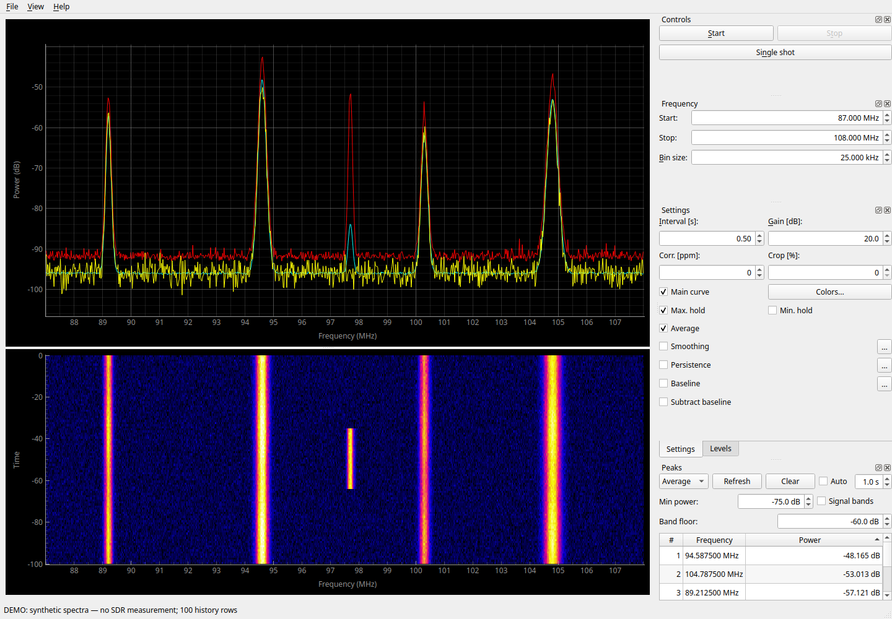
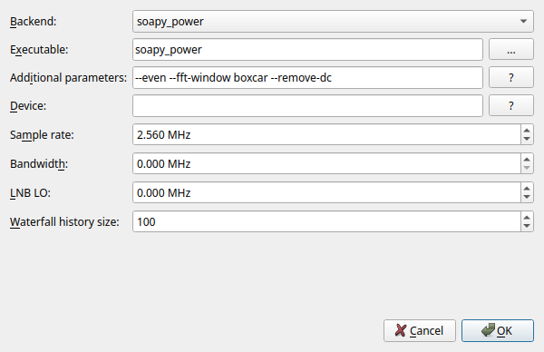
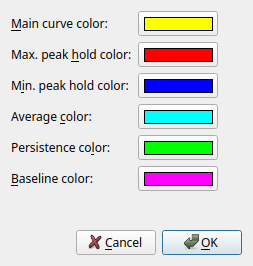
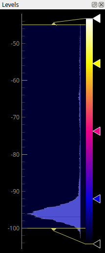
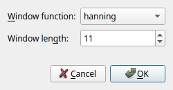
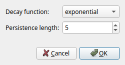
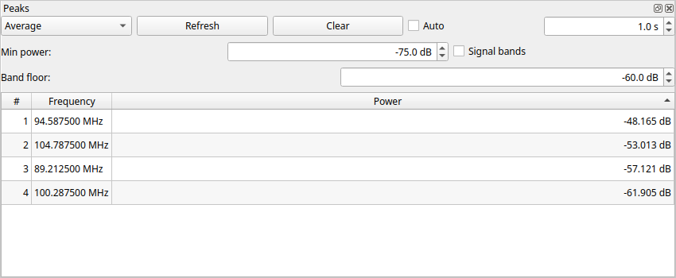
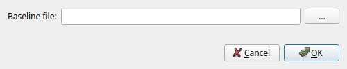
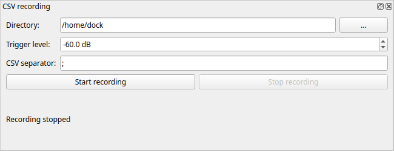

# QSpectrumAnalyzer: руководство пользователя

Руководство описывает функции текущего кода проекта, версия приложения —
**2.2.0**. Обновлено: **17 сентября 2026 года**. Названия кнопок и полей
приведены на языке соответствующего элемента интерфейса.

Инструкция по установке и подключению оборудования находится в
[INSTALL_UBUNTU_26_RU.md](INSTALL_UBUNTU_26_RU.md).
Создание установочного пакета для Debian описано в
[BUILD_DEB_RU.md](BUILD_DEB_RU.md).

## Содержание

1. [Назначение программы](#1-назначение-программы)
2. [Запуск](#2-запуск)
3. [Первое измерение](#3-первое-измерение)
4. [Главное окно и панели](#4-главное-окно-и-панели)
5. [Параметры измерения](#5-параметры-измерения)
6. [Выбор backend и устройства](#6-выбор-backend-и-устройства)
7. [Спектр и управление графиками](#7-спектр-и-управление-графиками)
8. [Водопад и цветовая шкала](#8-водопад-и-цветовая-шкала)
9. [Обработка спектра](#9-обработка-спектра)
10. [Поиск пиков и полос сигналов](#10-поиск-пиков-и-полос-сигналов)
11. [Фоновый спектр Baseline](#11-фоновый-спектр-baseline)
12. [Запись CSV, экспорт и сохранение настроек](#12-запись-csv-экспорт-и-сохранение-настроек)
13. [Практические сценарии](#13-практические-сценарии)
14. [Сообщения и устранение затруднений](#14-сообщения-и-устранение-затруднений)
15. [Ограничения текущей версии](#15-ограничения-текущей-версии)
16. [Слепки спектра и водопада](#16-слепки-спектра-и-водопада)
17. [Анализ записей CSV](#17-анализ-записей-csv)
18. [Новые устойчивые сигналы](#18-новые-устойчивые-сигналы)
19. [Анализ слепков спектра](#19-анализ-слепков-спектра)
20. [Мобильный сервер и приложение](#20-мобильный-сервер-и-приложение)

## Об иллюстрациях

Скриншоты сделаны в запущенном приложении с PyQt5. Спектры, водопад и
таблицы на них заполнены **синтетическими демонстрационными данными**;
это не запись радиоэфира и не результаты измерения конкретного SDR.
Настройки на снимках служат для иллюстрации элементов управления.
Часть иллюстраций сделана до последних изменений: точные названия и поведение элементов описаны в тексте ниже.

## 1. Назначение программы

QSpectrumAnalyzer показывает распределение уровня сигнала по частоте и его
изменение во времени. Измерения выполняет внешняя программа — **backend**,
которая управляет SDR-приёмником. QSpectrumAnalyzer задаёт её параметры,
принимает результаты и строит графики.

Доступны непрерывное сканирование и одиночный проход, текущий спектр,
усреднение, накопление максимумов и минимумов, сглаживание, послесвечение,
водопад, поиск пиков, выделение полос сигналов и вычитание опорного спектра.

Интерфейс подписывает уровень как **Power, dB**. Не следует автоматически
считать эти значения калиброванными dBm: их смысл зависит от backend,
приёмника и настройки измерения. Программа сама не выполняет абсолютную
калибровку измерителя мощности.

## 2. Запуск

В активированном окружении обычная команда запуска:

```bash
qspectrumanalyzer
```

Также доступен запуск модулем:

```bash
python -m qspectrumanalyzer
```

Для существующего окружения на этом компьютере проверен запуск с явным
выбором PyQt5 и без принудительного системного `PYTHONPATH`:

```bash
env -u PYTHONPATH QT_PREFERRED_BINDING=PyQt5 PYQTGRAPH_QT_LIB=PyQt5 \
    /home/dock/venv/qspectr/bin/qspectrumanalyzer
```

Строка для ярлыка GNOME с явным выбором X11/XWayland:

```ini
Exec=env -u PYTHONPATH QT_PREFERRED_BINDING=PyQt5 PYQTGRAPH_QT_LIB=PyQt5 QT_QPA_PLATFORM=xcb /home/dock/venv/qspectr/bin/qspectrumanalyzer
```

Путь относится к данному компьютеру; на другой установке замените его.
`Terminal=true` в ярлыке оставляет видимыми сообщения backend и диагностику.


При запуске из ярлыка Python из venv не добавляет автоматически его `bin` в `PATH`.
Если backend установлен в этом окружении, задайте в **File → Settings → Executable**
полный путь, например `/home/dock/venv/qspectr/bin/soapy_power`. Ошибка
`FileNotFoundError: soapy_power` может означать отсутствие команды в PATH,
а не отсутствие установки. Для проверки выполните этот полный путь с `--help`.
Приложение проверяет доступность исполняемого файла перед началом измерения.

Параметр `--version` выводит версию, `--help` — справку запуска.
Предусмотрен также `--debug`; он, в частности, сохраняет консоль на Windows.
Основные параметры измерений задаются в окне приложения.

## 3. Первое измерение

1. Подключите приёмник и закройте другие программы, использующие его.
2. Откройте **File → Settings...**.
3. Выберите **Backend**, укажите **Executable** и **Device**.
4. Проверьте **Sample rate**, при необходимости **Bandwidth**, нажмите **OK**.
5. В панели **Frequency** задайте **Start**, **Stop** и **Bin size**.
   Начальная частота должна быть меньше конечной, обе — в диапазоне устройства.
6. В панели **Settings** задайте **Interval**, **Gain**, при необходимости
   **Corr.** и **Crop**.
7. Нажмите **Single shot**, чтобы получить одиночное измерение, или **Start**
   для непрерывной работы.
8. Для завершения измерения нажмите **Stop**.

**Каждый новый Start или Single shot начинает новую серию:** очищаются
история водопада, накопленные среднее/максимумы/минимумы и таблица пиков.
Stop прекращает получение данных; результаты можно рассматривать после остановки.

Параметры приёмника применяются при запуске измерения. После изменения частот,
усиления или интервала остановите и заново запустите сканирование.
Переключатели отображения и обработки можно использовать для уже полученных данных.
Принятие диалога **File → Settings...** останавливает активный backend и
создаёт новое хранилище данных; рассматривайте это как перенастройку измерения.

## 4. Главное окно и панели



*Рисунок 1. Главное окно: текущий спектр — жёлтый, среднее — голубое,
максимумы — красные. Кратковременный демонстрационный сигнал около 97,7 MHz
остаётся в Max. hold и виден отдельным отрезком на водопаде.*

В центральной части находятся спектр и водопад. Разделитель между ними
позволяет менять их высоту.

| Панель | Содержимое |
| --- | --- |
| Controls | Start, Stop, Single shot |
| Frequency | Начальная и конечная частота, размер частотного отсчёта |
| Settings | Интервал, усиление, коррекция, обрезка, кривые и обработка |
| Levels | Гистограмма, уровни и палитра водопада |
| Peaks | Таблица пиков или полос сигналов |
| CSV recording | Запись проходов и частотных отсчётов выше порога в CSV |
| Spectrum snapshots | Слепки спектра и водопада: PNG, данные, имена и просмотр |
| Новые устойчивые сигналы | Поиск новых полос относительно зафиксированного фона |

Панели можно перемещать за заголовок, располагать вкладками, отделять от окна
и закрывать. Вернуть отдельную панель можно через **View → имя панели**.
**View → Show All Panels** показывает все панели, но не сбрасывает их
расположение к заводскому виду.

**File → Quit** закрывает приложение, **Help → About** показывает сведения
о программе. При обычном закрытии сохраняются основные настройки и геометрия окна.

Строка состояния во время измерения показывает:

- **Total time** — время текущей серии;
- **Sweep time** — интервал между последними обновлениями данных;
- **FPS** — частоту обновления, рассчитанную из этого интервала;
- **Frequency hops** — число частотных перестроек, если backend его предоставляет.

Индикатор прогресса ориентируется на заданный Interval. Это оценка ожидания,
а не точный процент уже просканированного диапазона.

## 5. Параметры измерения

| Поле | Единицы | Значение и применение |
| --- | --- | --- |
| Start | MHz | Нижняя граница обзора |
| Stop | MHz | Верхняя граница обзора |
| Bin size | kHz | Запрашиваемый размер частотного отсчёта; меньший размер даёт больше точек |
| Interval | s | Интервал/время накопления, интерпретация зависит от backend |
| Gain | dB | Запрашиваемое усиление приёмника |
| Corr. | ppm | Частотная коррекция для backend и устройств, которые её поддерживают |
| Crop | % | Исключение краёв отдельных участков спектра, где могут быть искажения |

Меньший Bin size помогает различать близкие сигналы, но увеличивает объём
данных и нагрузку. Фактический шаг зависит от FFT и округлений backend.
Число знаков в таблице частот не означает такую же точность измерения.

Увеличение Gain поднимает сигналы, но может привести к перегрузке приёмника.
Для сравнения нескольких измерений сохраняйте одинаковое фиксированное усиление.
Отрицательное значение Gain в ряде адаптеров означает, что явное усиление
не передаётся backend; конкретный автоматический режим определяется утилитой.
Для hackrf_sweep отрицательное значение не следует считать полноценным AGC.

Crop поддерживается не всеми backend. Слишком большое значение может сделать
настройку непригодной; доступность числа в поле не гарантирует, что выбранная
утилита и устройство смогут с ним работать.

Пределы полей меняются при выборе backend. Это общие пределы адаптера,
а не результат автоматического определения возможностей подключённого устройства.

## 6. Выбор backend и устройства

### Поддерживаемые адаптеры

| Backend | Назначение и особенности текущего приложения |
| --- | --- |
| soapy_power | Backend по умолчанию, работа через SoapySDR; выбор устройства строкой Device |
| hackrf_sweep | Обзор диапазона средствами HackRF; бинарный поток результатов |
| rtl_power | Работа с RTL-SDR через rtl_power |
| rtl_power_fftw | Работа с RTL-SDR через альтернативную FFTW-утилиту |
| rx_power | Адаптер rx_tools; в README проекта помечен как неподдерживаемый |

Наличие адаптера в списке не означает, что соответствующая утилита и драйвер
установлены. Поддержка конкретного SDR зависит от внешнего программного обеспечения.

Для hackrf_sweep адаптер использует sample rate 20 MHz, ограничивает Bin size
диапазоном 3–5000 kHz и округляет ширину обзора до шагов 20 MHz.
Общее усиление распределяется между LNA и VGA. PPM и Crop этим адаптером
не применяются; поле Device не передаётся как отдельный выбор устройства.
Interval здесь ограничивает частоту передачи проходов в приложение.

### Поля File → Settings...



*Рисунок 2. Настройки backend: исполняемый файл, устройство, частота
дискретизации, полоса, смещение LNB и дополнительные параметры.*

| Поле | Описание |
| --- | --- |
| Backend | Внешняя программа для получения спектра |
| Executable | Имя команды или путь к исполняемому файлу; кнопка `...` открывает выбор файла |
| Device | Идентификатор устройства в формате выбранного backend |
| Sample rate | Частота дискретизации в MHz; не равна ширине всего обзора |
| Bandwidth | Запрашиваемая полоса приёмника в MHz, если поддерживается |
| LNB LO | Частотное смещение внешнего преобразователя в MHz |
| Waterfall history size | Число строк спектра в памяти, по умолчанию 100 |
| Additional parameters | Дополнительные аргументы командной строки backend |

Для soapy_power примеры Device: `driver=hackrf`, `driver=rtlsdr`,
`driver=plutosdr`. Это примеры селекторов; при нескольких устройствах может
понадобиться серийный номер или другой уточняющий параметр.

Кнопка **?** возле Device доступна для backend, предоставляющего такую справку.
У soapy_power она запускает обнаружение и запрос информации об устройстве.
Кнопка **?** возле Additional parameters показывает справку установленной утилиты.

У soapy_power значение Bandwidth 0 означает, что приложение не передаёт
явный параметр полосы. Для LNB LO подсказка интерфейса задаёт отрицательное
смещение для повышающего преобразователя и положительное для понижающего.
Без преобразователя оставьте 0.

Дополнительные параметры soapy_power по умолчанию:

```text
--even --fft-window boxcar --remove-dc
```

Они передаются внешней утилите. Не добавляйте параметры, меняющие формат
выходных данных или способ их передачи: приложение ожидает определённый протокол.
Также избегайте противоречащих друг другу настроек в полях и дополнительных аргументах.

После смены Backend сбрасываются некоторые поля диалога, а после его
подтверждения — некоторые основные параметры. Поэтому сначала выбирайте
backend, затем проверяйте частоты и параметры измерения.

## 7. Спектр и управление графиками

Горизонтальная ось — частота, вертикальная — уровень в dB. Масштаб единиц
частоты на оси может автоматически меняться.

Перемещение мыши над спектром показывает перекрестие и подпись `f=... MHz,
P=... dB`. Это **координаты указателя**, а не автоматическое измерение
ближайшего пика. При включённом **Follow cursor** в Peaks левый щелчок
привязывает перекрестие к вершине пика из таблицы непосредственно под указателем.
Одинарный щелчок по строке Peaks переносит перекрестие к этому пику.
При движении мыши перекрестие снова свободно следует за ней.

Двойной щелчок по основному спектру устанавливает оба поля **Trigger level**
(Peaks и CSV recording) по вертикальной координате щелчка, в том числе во время записи.
При запуске приложения частотный масштаб устанавливается по полям Start–Stop.

Перетаскивание и колесо мыши позволяют перемещать и масштабировать график.
Правая кнопка открывает меню PyQtGraph с настройками осей, вида и экспортом.
Точный состав стандартного меню зависит от установленной версии PyQtGraph.

Частотные оси спектра и водопада связаны. Команда **View All** на любом
из графиков возвращает оба к диапазону Start–Stop. Для спектра подбирается
вертикальный диапазон по имеющимся данным, в том числе накопленным кривым
и baseline; поэтому скрытая кривая тоже может влиять на получившийся масштаб.

### Отображаемые кривые

| Переключатель | Что показывает | Цвет по умолчанию |
| --- | --- | --- |
| Main curve | Последний обработанный спектр | Жёлтый |
| Max. hold | Максимум для каждой частотной точки в серии | Красный |
| Min. hold | Минимум для каждой частотной точки в серии | Синий |
| Average | Накопленное среднее | Голубой |
| Persistence | Следы предыдущих спектров с затуханием | Зелёный |
| Baseline | Загруженный опорный спектр | Пурпурный |

Флажки Main curve, Max. hold, Min. hold и Average управляют видимостью,
а не отдельным запуском измерения. Накопление статистики идёт и при скрытых
кривых. Для сброса накопления остановите и начните новую серию.

**Colors...** открывает выбор цветов перечисленных кривых. Цвета водопада
меняются отдельно, в Levels.



*Цвета основной кривой, максимумов, минимумов, среднего, послесвечения
и baseline настраиваются независимо.*

## 8. Водопад и цветовая шкала



*Рисунок 3. Панель Levels. Границы на гистограмме задают диапазон уровней
для отображения; цветовая полоса задаёт соответствие уровня и цвета.*

Каждая строка водопада — один полученный спектр. Цвет кодирует уровень.
Новые строки располагаются у отметки 0, старые сдвигаются к отрицательным
значениям вертикальной шкалы.

Несмотря на подпись **Time**, вертикальная шкала текущей версии измеряется
**строками истории, а не секундами**. Например, 100 строк при фактическом
обновлении раз в 0,5 s соответствуют приблизительно 50 s наблюдения.
При неравномерных обновлениях это только оценка.

Waterfall history size ограничивает число хранимых строк. При заполнении
старые данные вытесняются. Изменять масштаб по вертикали мышью нельзя:
он закреплён по размеру истории. Частотный масштаб связан со спектром.

В панели **Levels** изменяйте границы уровней на гистограмме, чтобы выделить
слабые сигналы и не пересветить сильные. Редактор цветового градиента позволяет
выбрать палитру; исходная палитра — `flame`.
Изменение палитры и уровней меняет изображение, но не измеренные значения.
**Reset to defaults** возвращает палитру `flame`, автоматически подбирает уровни
по текущим данным и восстанавливает автоматический масштаб гистограммы.

**View → Waterfall** включает и выключает водопад. Выключение скрывает также
Levels, прекращает обработку изображения и освобождает его ресурсы. Объём
хранимой истории сокращается до необходимого для остальных функций, например
Persistence. Видимость сохраняется между запусками. Скрытый водопад не накапливает
полную историю для последующего восстановления. Выбор его слепка при выключенном
водопаде не запускает загрузку и не открывает окно ошибки.

Основная история хранится без сглаживания. Вычитание baseline, напротив,
влияет и на водопад. Поэтому после включения Smoothing линия спектра может
стать ровнее, а водопад сохранить мелкие детали.

Большая история при мелком Bin size требует много памяти. Только массив
из 1000 строк по 100000 отсчётов занимает около 800 MB; отображение и
промежуточные данные требуют дополнительной памяти.

## 9. Обработка спектра

### Average, Max. hold и Min. hold

Average усредняет значения в каждой частотной точке. Усреднение выполняется
над поступающими значениями уровня, а не через перевод dB в линейную мощность.
Max. hold сохраняет наибольшие, Min. hold — наименьшие значения по точкам.

При неизменных настройках статистика накапливается в пределах серии.
Изменение сглаживания или baseline вызывает пересчёт по оставшейся истории:
старые, уже вытесненные строки в такой пересчёт не входят.

### Smoothing



*Рисунок 4. Выбор функции и длины окна сглаживания.*

Флажок **Smoothing** включает сглаживание по соседним частотным точкам.
Кнопка **...** рядом открывает параметры:

- **Window function**: `rectangular`, `hanning`, `hamming`, `bartlett`, `blackman`;
- **Window length**: длина окна в отсчётах, по умолчанию 11;
- функция по умолчанию — `hanning`.

`rectangular` соответствует скользящему среднему. Чем шире окно, тем сильнее
сглаживание и тем заметнее могут уменьшаться узкие пики. Это обработка
готового спектра; она отличается от FFT-окна внешнего backend.
Длина окна не должна превышать число точек спектра.

### Persistence



*Рисунок 5. Длина послесвечения в кадрах и закон затухания.*

Флажок **Persistence** добавляет следы предыдущих спектров. В диалоге **...**:

- **Persistence length** — количество следов, по умолчанию 5;
- **Decay function** — `linear` или `exponential`, по умолчанию `exponential`.

Затухание выражается прозрачностью старых кривых. Длина задаётся в кадрах,
а не секундах. Этот режим помогает видеть кратковременные изменения и
отличается от Max. hold: он показывает отдельные недавние кривые.

## 10. Поиск пиков и полос сигналов



*Рисунок 6. Увеличенная панель Peaks: источник Average, ручное обновление,
порог −75 dB и таблица максимумов демонстрационного спектра.*

Панель **Peaks** анализирует Average или Max hold и показывает локальные
максимумы либо непрерывные полосы выше Band floor.

| Элемент | Действие |
| --- | --- |
| Average / Max hold | Источник анализа |
| Refresh / Clear | Пересчитать таблицу / очистить строки без сброса накопленного спектра |
| Auto и интервал | Автообновление; изначально выключено, интервал по умолчанию 1 s |
| Trigger level | Минимальный уровень включаемого пика; сохраняется между сеансами |
| Signal bands | Объединить точки в полосы по порогу Band floor |
| Band floor | Уровень определения границ и ширины полосы |
| Round MHz | Округлять частоты в таблице |
| Число знаков и метод | 0–6 знаков в MHz; ближайшее, к чётному, вниз или вверх |
| Follow cursor | Связать щелчки по таблице и пикам на основном спектре |
| Max rows | Максимум строк; **All** показывает все найденные результаты |

Статус **Shown: … / … found** показывает число выведенных и найденных результатов.
Если Auto выключен, после изменения спектра нажмите Refresh. Сортировка по
заголовку не меняет источник данных. Фиксированного ограничения в 20 пиков больше нет.

В режиме пиков доступны **#**, **Frequency**, **Power**, **Width**; в режиме
полос — границы **Band**, частота вершины **Peak**, уровень **Power** и **Width**.
Частоты указаны в MHz, ширина — в kHz. Ширина определяется по Band floor;
если её определить нельзя, показано тире. Это пороговая ширина, а не полоса
по заданному проценту мощности. Соседние максимумы без провала ниже Band floor
в режиме Signal bands образуют одну полосу.

Округление меняет отображение частот, но не исходные координаты пиков или ширину.
**Nearest (half up)** округляет половину вверх, **Nearest (half to even)** —
к ближайшему чётному, **Down (floor)** — вниз, **Up (ceiling)** — вверх.
Настройки округления, Follow cursor, Trigger level и Max rows сохраняются.
Источник, Auto, интервал, Signal bands и Band floor заново принимают исходные значения.
Щелчки не перенастраивают приёмник и не запускают декодирование.

## 11. Фоновый спектр Baseline



*Рисунок 8. Выбор baseline-файла. Пустое поле на снимке означает,
что опорный файл ещё не выбран.*

Baseline — опорный спектр, загруженный из файла. Его можно показывать
отдельной кривой и вычитать из измеряемого спектра.

1. Нажмите **...** рядом с Baseline.
2. В поле **Baseline file** выберите файл.
3. Подтвердите выбор кнопкой **OK**.
4. Включите **Baseline**, чтобы видеть опорную кривую.
5. Включите **Subtract baseline**, чтобы вычитать её из данных.

Оба флажка независимы: показ фона не включает вычитание, а вычитание
не требует показа опорной кривой.

Читается **бинарный формат soapy_power**, а не произвольный CSV, изображение
или запись IQ. Если файл содержит несколько проходов, они усредняются.
Отдельной кнопки записи текущего спектра в baseline-файл в приложении нет;
его нужно подготовить внешними средствами, поддерживающими этот формат.

Для корректного вычитания используйте совпадающие частотный диапазон,
число отсчётов, их расположение и параметры измерения. Приложение проверяет
совпадение длины массивов, но не гарантирует совпадение частотных сеток и
не интерполирует фон автоматически. При разной длине вычитание не применяется.

Вычитание производится непосредственно над значениями уровня. Если данные
выражены в dB, результат — разность уровней в dB, а не вычитание физических
мощностей в линейных единицах. Меняются основной спектр, статистика и водопад.

## 12. Запись CSV, экспорт и сохранение настроек

### Панель CSV recording



*Панель записи CSV. Настройки записи независимы от кнопок управления
приёмником и порогов таблицы Peaks.*

Панель доступна через **View → CSV recording**. Её можно перемещать,
отделять от главного окна, объединять вкладками и скрывать. По умолчанию
она расположена вкладкой рядом с Peaks. **Show All Panels** возвращает
и эту панель.

| Элемент | Назначение |
| --- | --- |
| Directory | Существующий каталог для файлов CSV; кнопка `...` открывает выбор каталога |
| Trigger level | Порог уровня в dB, по умолчанию −60 dB |
| CSV separator | Один символ-разделитель; по умолчанию точка с запятой `;` |
| Start recording | Немедленно создать новый файл и начать ожидать новые данные |
| Stop recording | Завершить запись и закрыть файл |

Порядок работы:

1. Выберите каталог, порог и разделитель.
2. Нажмите **Start recording**. Даже если измерение ещё не запущено,
   будет создан CSV с заголовком. С этого момента отсчитывается время записи.
3. Запустите измерение обычной кнопкой **Start** или **Single shot**,
   если оно ещё не выполняется.
4. Следите за именем файла и числом записанных строк в панели. Полный путь
   виден во всплывающей подсказке над статусом записи.
5. Нажмите **Stop recording**, чтобы завершить файл.

Во время записи каталог и разделитель заблокированы. **Trigger level можно менять**:
каждый проход сохраняет применённый порог. Для изменения каталога или разделителя остановите запись; следующий Start recording создаст новый
файл с новым отсчётом времени. Имена имеют вид
`signals_20260910_123456_123456_a1b2c3d4.csv`: дата, время и уникальный суффикс
предотвращают перезапись предыдущих сеансов.

Записываются **все частотные отсчёты текущего обработанного спектра строго
выше порога**, а не только локальные максимумы или строки Peaks. Значение,
равное порогу, не записывается. На каждом новом проходе подходящие частоты
записываются снова. Поэтому широкий сигнал может давать много строк.
На результат влияют Smoothing и Subtract baseline; флажок видимости Main
curve не влияет на запись. Average и Max hold не являются источником CSV.

Формат файла — UTF-8, первая строка содержит названия столбцов:

```csv
frequency_hz;power_db;system_time;elapsed_ms;record_type;sweep_id;start_frequency_hz;stop_frequency_hz;threshold_db;bin_count;valid_bin_count;hit_count
```

| Столбец | Содержимое |
| --- | --- |
| frequency_hz / power_db | Частота в Hz и уровень в dB; пусты в строке прохода |
| system_time | Системные дата и время с миллисекундами и часовым поясом |
| elapsed_ms | Миллисекунды от начала записи |
| record_type | `sweep` — сведения о проходе, `signal` — превышение порога |
| sweep_id | Номер прохода внутри записи |
| start_frequency_hz / stop_frequency_hz | Диапазон, соответствующий полученному проходу |
| threshold_db | Порог данного прохода |
| bin_count / valid_bin_count | Число отсчётов и число отсчётов с конечными значениями |
| hit_count | Число превышений порога |

Для каждого прохода записывается строка `sweep`, **даже при нуле превышений**,
затем строки `signal` для отсчётов строго выше порога. Сведения о диапазоне,
пороге и числе отсчётов находятся в строке `sweep`; принадлежность сигналов
проходу определяется через `sweep_id`. Отсутствие превышений не означает
отсутствие излучения: сигнал мог быть ниже порога.

Время фиксируется при поступлении полного спектра в приложение; все строки
одного прохода имеют одинаковые временные метки. Это время получения спектра,
а не точное время измерения каждого отсчёта SDR. Относительное время использует
монотонные часы: перевод системных часов не сбрасывает его. Десятичный
разделитель чисел — точка, независимо от выбранного разделителя столбцов.

Остановка измерения приёмника не завершает файл записи: панель ждёт следующие
спектры, а относительное время продолжает идти. Скрытие панели также не
останавливает запись. **Stop recording** закрывает файл; обычное закрытие
приложения тоже завершает запись. Новый запуск приложения не возобновляет
её автоматически. Старые кадры, полученные до Start recording, исключаются.

После каждого записанного прохода данные сбрасываются из буфера файла.
При ошибке создания или записи файла показывается сообщение и запись
останавливается. Каталог должен существовать и быть доступен для записи.

Каталог, порог и разделитель сохраняются между сеансами. Для разделителя
допускается один символ, кроме двойной кавычки, перевода строки и нулевого
символа. Например, можно использовать `;`, `,` или `|`.

### Экспорт графиков и остальные настройки

Для экспорта откройте контекстное меню графика правой кнопкой мыши и выберите
**Export...**. Выберите нужный объект, доступный формат и параметры экспорта.
Набор форматов определяется установленной версией PyQtGraph и типом объекта.
Экспорт видимого графика не является записью всей последовательности измерений.
Для порогового журнала частот используйте CSV recording, описанную выше.

В текущем интерфейсе нет отдельной команды экспорта таблицы Peaks,
записи IQ или воспроизведения записи как потока измерений. Для сохранения доступной
истории водопада используйте слепки, для просмотра CSV — Analyze recording. Чтение файла baseline не является режимом воспроизведения спектра.

При обычном закрытии сохраняются частоты, Bin size, Interval, Gain, PPM,
Crop, переключатели кривых и обработки, положение и размеры окна, состояние
панелей и разделителя. Настройки backend и диалогов сохраняются после OK.

Измеренные спектры и накопленная статистика между запусками не сохраняются.
В Peaks сохраняются Trigger level, округление, Follow cursor и Max rows; остальные
параметры перечислены в разделе 10. Собственного сохранения палитры/уровней водопада также нет.

## 13. Практические сценарии

### Рассмотреть устойчивые сигналы

1. Задайте диапазон, начните измерение с фиксированным Gain.
2. Включите Main curve и Average, дождитесь нескольких проходов.
3. В Peaks выберите Average и нажмите Refresh либо включите Auto.
4. Поднимите Trigger level, если в списке слишком много слабых максимумов.
5. Остановите измерение и увеличьте интересующий участок графика.

### Найти кратковременные сигналы

1. Начните новую серию, включите Max. hold и при необходимости Persistence.
2. Наблюдайте отдельные появления на водопаде.
3. Выберите Max hold в Peaks и обновите список.
4. Перед следующей независимой проверкой выполните Stop → Start,
   иначе старые максимумы останутся в накопленной кривой.

### Оценить границы широкого сигнала

1. Выберите Average в Peaks и включите Signal bands.
2. Задайте Band floor выше наблюдаемого фона, но ниже основной части сигнала.
3. Настройте Trigger level для отбора нужных полос.
4. Сопоставьте границы в таблице с графиком; попробуйте соседние значения
   Band floor, чтобы понять зависимость результата от порога.

### Сравнить с опорным измерением

1. Загрузите совместимый baseline-файл и покажите Baseline.
2. Проверьте соответствие диапазона и условий измерения.
3. Включите Subtract baseline и оцените разность уровней.
4. Для следующего сравнения с другими условиями подготовьте соответствующий фон.

## 14. Сообщения и устранение затруднений

| Симптом | Что проверить или сделать |
| --- | --- |
| Закрыта нужная панель | View → имя панели или Show All Panels |
| График ушёл за пределы окна | View All в контекстном меню графика |
| Водопад слишком тёмный или одноцветный | Уровни и градиент в Levels |
| Таблица Peaks пустая | Наличие данных, Refresh/Auto, Trigger level; в режиме полос также Band floor |
| После Clear пики появились снова | Clear очищает таблицу, а не накопленные данные |
| Старый сигнал остаётся в Max hold | Начните новую серию через Stop → Start |
| Нет данных от приёмника | Executable, Device, драйверы, диапазон и сообщения внешней утилиты в терминале |
| Device or resource busy | Завершите другое приложение, использующее SDR |
| Высокая нагрузка или задержки | Уменьшите диапазон/историю/Persistence, увеличьте Bin size; снизьте частоту обновления |
| Ошибка длины окна сглаживания | Уменьшите Window length до числа отсчётов спектра или ниже |
| Baseline не вычитается | Проверьте файл, формат, число отсчётов и флажок Subtract baseline |

При `ImportError: cannot import name 'uic' from 'PyQt6'` используйте
явный выбор PyQt5 из раздела «Запуск». В проверенном окружении системный
PyQt6 может выбираться автоматически; сам traceback не позволяет установить,
какая установка или обновление изменили окружение.

Предупреждения `undefined symbol ... version Qt_5` могут возникать при
смешивании системного PyQt5 и библиотек из venv. В данном окружении они
воспроизводились с `PYTHONPATH=/usr/lib/python3/dist-packages` и исчезали
после удаления этой переменной для запуска.

`Ignoring XDG_SESSION_TYPE=wayland on Gnome` само по себе не означает сбой:
приложение использует X11/XWayland. В приведённом ярлыке этот режим выбран
явно через `QT_QPA_PLATFORM=xcb`.

Сообщение `Frequency axis rebuilt from configured range` описывает
перестроение частотной шкалы под Start–Stop. Оно не подтверждает точность
частот при несовпадении запрошенного и фактического диапазона backend.

## 15. Ограничения текущей версии

- Частотная шкала строится равномерно по заданным Start–Stop. Если backend
  округлил диапазон, передал неполный проход или неравномерную сетку, частоты
  на графике и в Peaks могут не соответствовать фактическим. Особенно учитывайте
  округление диапазона hackrf_sweep до шагов 20 MHz.
- Число знаков после запятой в Peaks не заменяет частотную калибровку SDR
  и не повышает разрешение, заданное измерением.
- Изменение обработки пересчитывает статистику по доступной истории,
  а не обязательно по всей прошедшей серии.
- Водопад хранит ограниченное число строк; его шкала Time не является
  шкалой точных временных меток.
- В программе нет демодуляции звука, декодирования протоколов, автоматического
  распознавания передатчиков, системы частотных закладок или оповещений.
- Справка и допустимые параметры внешней утилиты зависят от её установленной
  версии. Пределы полей приложения не заменяют проверку возможностей приёмника.

Руководство сверено с исходным кодом текущей версии. Приложение запускалось с PyQt5 для
съёмки интерфейса и отображения демонстрационных данных; это не является
проверкой измерений со всеми перечисленными SDR и backend.


## 16. Слепки спектра и водопада

Откройте **View → Spectrum snapshots**. Панель можно перемещать и объединять
вкладками, как остальные панели.

| Элемент | Назначение |
| --- | --- |
| Directory и `...` | Каталог сохранения; запоминается между запусками |
| Snapshot type | **Spectrum** — спектр, **Waterfall** — водопад |
| Capture snapshot | Сохранить текущий выбранный тип |
| Refresh list | Обновить список файлов каталога |
| Display on graph | Загружать выбранные слепки для сравнения; всегда выключено при запуске |
| Name / Captured / Range [MHz] / Curves / Type | Имя, время создания, диапазон, число кривых и тип |

### Создание и имена

1. Выберите существующий каталог и тип слепка.
2. Для спектра включите нужные кривые и получите данные. Для водопада включите
   **View → Waterfall** и накопите историю.
3. Нажмите **Capture snapshot**. Пара файлов с одинаковой основой имени содержит
   **PNG** графика и **NPZ** с данными. Спектр хранит частоты и уровни видимых
   текущих кривых; водопад — частоты, доступные строки истории, диапазон,
   уровни отображения, палитру и временные метки строк. Слепки, показанные для сравнения, в новый
   слепок текущего спектра не включаются.
4. Дождитесь **Snapshot saved (PNG + NPZ)**. Во время фоновой записи повторное
   создание заблокировано; измерения могут продолжаться.
5. Выберите ячейку **Name**, нажмите **F2**, введите имя и подтвердите Enter.
   Имя сохраняется внутри NPZ в фоне. **Saving snapshot name…** сменится на
   **Snapshot name saved**. Файлы не переименовываются; повторная загрузка
   отображённого графика не требуется.

Наведение на строку показывает превью из PNG. Для переноса слепка копируйте
оба файла пары; без PNG данные можно открыть, но превью будет недоступно.
NPZ не является записью IQ или baseline-файлом.

### Временные метки водопада

Новые NPZ водопада содержат массив `timestamps`: одна строка на строку
`history`, два столбца — `unix_seconds` и `monotonic_seconds`. Первый хранит
системное время получения прохода приложением в секундах Unix; второй нужен
для измерения интервалов без влияния перевода системных часов. Это время
получения всего прохода, а не отдельной частоты при перестройке приёмника.
Строки истории и меток идут от старых к новым; на изображении свежий проход
показывается сверху. Шкала водопада остаётся шкалой проходов.

Монотонные метки нельзя использовать как календарные даты или напрямую
сравнивать между разными компьютерами и перезагрузками. Старые слепки без
`timestamps` остаются совместимыми для просмотра, но восстановить точное время
каждого прохода по ним нельзя. Обновление программы само по себе файлы не удаляет.

### Сравнение

Включите **Display on graph** и выберите строку. Чтение, распаковка и подготовка
водопада выполняются в фоне; статус — **Loading snapshot…**. При смене строки
устаревший результат не выводится.

Сохранённый спектр появляется **под основным спектром**, сохранённый водопад —
**под текущим водопадом**. Обе истории могут быть видны одновременно. Новый
слепок заменяет только историю своего типа. Частотные масштабы связаны с
соответствующими текущими графиками; сохранённый спектр имеет свою шкалу dB.
Снятие Display on graph скрывает обе истории.

Для водопада диапазон должен совпадать с настройками и диапазоном текущих
данных. При несовпадении сохранённый водопад не выводится, появляется сообщение.
Изменение диапазона также скрывает несовместимую историю водопада. Если видимость
водопада выключена, его слепок не загружается; история спектра остаётся доступной.
Палитра и уровни сохранённого водопада берутся из файла.

### Применение диапазона

**Двойной щелчок по любой ячейке строки** вызывает вопрос о применении диапазона.
После **Yes** сканирование останавливается, поля Start и Stop получают границы
слепка, основной график масштабируется по ним. Отображение слепков выключается.
При **No** сканирование и поля частот не меняются. Сканирование автоматически
не возобновляется: нажмите Start при необходимости. Для водопада применяется
полный сохранённый диапазон, для спектра — сохранённый видимый диапазон.

Для сравнения водопада после смены диапазона сначала получите новые данные
в этом диапазоне. Одной смены полей недостаточно, если на экране ещё старая история.

Большой водопад требует времени и памяти: 100 проходов по миллиону отсчётов
занимают около 800 MB до сжатия. Сохранение, загрузка и переименование работают
в фоне; время зависит от объёма и накопителя. При закрытии приложение дожидается
завершения записи/переименования и отменяет вывод незавершённой загрузки.

## 17. Анализ записей CSV

Откройте **File → Analyze recording...**, затем **Open CSV...**. Лучше выбирать
завершённую запись. Поддерживаются прежние CSV из четырёх столбцов и новые файлы
с описанием проходов. Проверьте **Separator** при чтении файла.

Общие фильтры задают период от начала записи (**From recording start / To**),
частоты (**Frequency from / To**) и минимальный уровень (**Min level**).
**Also filter system time** добавляет ограничение по системным датам и времени.
**Full recording** возвращает просмотр всей записи.

### File data

Вкладка показывает строки файла, включая частоту сигнала. **Round signal frequencies**
включает округление частот в MHz: выберите 0–6 знаков и метод (ближайшее с
половиной вверх, к чётному, вниз или вверх). Три знака в MHz соответствуют kHz,
шесть — Hz. **Update graphs from table** применяет округлённые частоты к графикам.
**Restore original frequencies** возвращает исходные частоты. Исходный CSV
не переписывается; округление не повышает точность измерения.

### Analysis

1. **Recorded hits**: количество записанных превышений по времени от начала
   записи. Выделенная область задаёт период просмотра. Это число отсчётов,
   а не число независимых передатчиков.
2. **Recorded signals**: время по горизонтали, частота по вертикали. Чем крупнее
   точка, тем выше уровень. Наведение показывает время, частоту и dB; щелчок
   выбирает частоту для нижнего графика. Мышь масштабирует и перемещает только
   частоту; период задаётся сверху.
3. **Peak level in selected band**: пиковый уровень во времени для
   **Selected frequency** и **Band width**. Нулевая ширина выбирает ближайшую
   записанную частоту. Мышь изменяет масштаб уровня, а не времени.

Пустое место означает отсутствие записанных превышений, а не доказанное отсутствие
сигнала. Новые строки `sweep` позволяют отличать проход без превышений от отсутствия
зарегистрированного прохода; старый четырёхколоночный формат такой информации не содержит.


## 18. Новые устойчивые сигналы

Панель **View → Новые устойчивые сигналы** ищет появившиеся после фиксации
фона полосы, которые сохраняются в нескольких проходах. При первом запуске
панель скрыта. Её можно перемещать и объединять вкладками, как остальные панели.
Это анализ числовых данных водопада во время сканирования, а не цветов PNG.

### Начало работы

1. Задайте диапазон, шаг частот и усиление. Включите **View → Waterfall**
   и запустите сканирование.
2. Накопите обычную картину эфира до появления искомого нового сигнала.
   Нужно минимум три прохода; для фона используются последние **до 64 проходов**
   доступной истории. При меньшей настройке Waterfall history size фон короче.
3. Откройте панель и задайте параметры из таблицы ниже.
4. Нажмите **Зафиксировать фон и начать**. Дождитесь сообщения о числе проходов
   фона. После этого фон не подстраивается под новые сигналы автоматически.
5. Продолжайте сканирование. Подтверждённые события появляются в таблице;
   активные полосы выделяются зелёным на спектре и видимом водопаде.
6. **Остановить анализ** прекращает поиск и очищает его таблицу и выделения,
   но не останавливает сканирование. Для изменения параметров остановите анализ,
   измените поля и снова зафиксируйте фон.

Повторная фиксация фона начинает анализ заново и очищает прежние результаты.
Если новый сигнал уже попал в историю фона, он может считаться известным.
Закрытие панели не останавливает анализ — используйте отдельную кнопку.

### Настройки

| Поле | По умолчанию | Значение |
| --- | --- | --- |
| Минимум, dB | −80 | Абсолютный нижний порог уровня кандидата |
| Превышение фона, dB | 8 | Насколько уровень должен превышать медианный фон на той же частоте |
| Подтверждение, с | 10 | Время наблюдения до подтверждения и длина скользящего окна присутствия |
| Присутствие, % | 80 | Минимальная доля проходов с обнаружением в этом окне |
| Допуск частоты, кГц | 20 | Допуск объединения близких отсчётов и сопоставления полос между проходами; также расширяет исключаемые известные частоты |

Настройки запоминаются при нажатии **Зафиксировать фон и начать**. Сам фон
и результаты между запусками не сохраняются. Во время анализа поля заблокированы.

Например, при фоне −95 dB и настройках −80 dB / 8 dB сигнал должен достичь
не менее −80 dB: превышения фона на 8 dB недостаточно для абсолютного порога.
При 10 с / 80% подтверждение требует истечения времени наблюдения, минимум
трёх проходов в текущем окне и присутствия сигнала хотя бы в 80% этих проходов.
Процент считается по проходам, а не по доле физического времени передачи.

### Как определяется новый сигнал

Для каждой частоты вычисляется медиана фоновых проходов. Частоты, которые
достигали абсолютного минимума хотя бы в **20% фоновых проходов**, считаются
известными и исключаются вместе с заданным частотным допуском. Поэтому рост
уровня уже известного передатчика не считается новым сигналом.

Остальные отсчёты должны одновременно пройти абсолютный порог и порог
превышения фона. Соседние отсчёты объединяются в полосы; допуск частоты помогает
сопоставлять их при небольшом дрейфе. Слишком большой допуск может объединить
разные близкие сигналы либо исключить новый сигнал возле известного.

Используются проходы **до Smoothing**, с учётом включённого **Subtract baseline**.
Кривые Average и Max hold, цвета и Levels на результат детектора не влияют.
Расчёт выполняется в рабочем потоке; таблица обновляется не чаще двух раз в секунду.
После фиксации фона водопад можно скрыть: анализ новых проходов продолжается.
Для подготовки следующего фона снова включите водопад и накопите историю.

### Таблица результатов

| Столбец | Смысл |
| --- | --- |
| № | Номер события; номера могут иметь пропуски из-за неподтверждённых кандидатов |
| Частота, МГц | Частота самой сильной точки полосы при последнем обнаружении |
| Ширина, кГц | Ширина последней обнаруженной полосы с учётом одного частотного отсчёта |
| Появление / Последний | Системное время первого и последнего обнаружения |
| Длительность, с | Разность этих времён; не сумма времени фактического излучения |
| Средний, dB | Арифметическое среднее пиковых уровней обнаружений в dB, не средняя линейная мощность |
| Максимум, dB | Наибольший уровень события за время наблюдения |
| Выше фона, dB | Превышение фона в вершине полосы при последнем обнаружении |
| Присутствие, % | Доля проходов с обнаружением в текущем временном окне |
| Состояние | Устойчивый либо Пропал / неустойчивый |

Нажатие заголовка сортирует таблицу по выбранному полю. Подтверждённое событие
остаётся в таблице после исчезновения. Хранятся до 2000 последних отслеживаемых
событий, включая неподтверждённые; выделяются до 100 активных полос.

### Сброс и ограничения

Новый **Start / Single shot**, перенастройка backend или пересчёт истории
при изменении baseline сбрасывают анализ. При изменении сетки частот или
нарушении порядка временных меток требуется повторная фиксация фона.
Пауза между проходами длиннее времени подтверждения прерывает подтверждение.
При остановленном сканировании состояния не обновляются по таймеру: последнее
«Устойчивый» не означает, что сигнал продолжает излучаться.

Это поиск относительно выбранного фона, а не распознавание передатчиков.
Изменение усиления, антенны или условий приёма требует нового фона. На широком
диапазоне приёмник наблюдает каждую частоту лишь часть времени, поэтому
присутствие отражает обнаружение в проходах, а не непрерывность передачи.

Отдельного экспорта событий, звуковых уведомлений, управления детектором
с телефона и автоматического поиска по сохранённым NPZ пока нет. CSV recording
работает независимо, по своему порогу: запуск детектора не включает запись CSV.

## 19. Анализ слепков спектра

Откройте **File → Analyze spectrum snapshots...**. Окно имеет две вкладки;
оно работает с сохранёнными данными и не требует запуска сканирования.

### Просмотр слепков

Выберите каталог кнопкой **Каталог…** и нажмите **Обновить**. Слева находится
таблица имён, типов, дат и диапазонов. Выберите спектр: он появится сверху.
Затем можно выбрать водопад для нижнего графика — выбранный спектр сохраняется.
Новая запись заменяет график своего типа.

Частотная шкала графиков общая. При несовпадении диапазонов сохранённый водопад
не показывается вместе со спектром; причина выводится в строке состояния.
Поле **Масштаб спектра** задаёт управление мышью: **Частота**, **Уровень** или
**Обе оси**. **Весь диапазон** возвращает обзор данных. Частотный масштаб
водопада следует за спектром, а его вертикальная шкала проходов фиксирована.

Курсор перемещается одновременно по частоте на спектре и водопаде.
Координаты показываются над графиком; щелчок левой кнопкой возле вершины
привязывает курсор к пику. Границы между областями окна можно перемещать.

### Сравнение пиков

Для этой вкладки нужен **слепок спектра, содержащий Average и Max hold**.
Перед созданием слепка включите обе кривые на ПК. Выберите этот слепок
на первой вкладке, затем перейдите в **Сравнение пиков**.

Поле **Минимальный уровень пика, dB** отбирает локальные максимумы Max hold.
Таблица содержит частоту, Max hold, Average на той же частоте, разность
`Max − Average` в dB и отношение **Average / Max, %**. Все поля сортируются
нажатием заголовка. При разных частотных сетках Average интерполируется;
вне его диапазона значение отсутствует.

Процент рассчитывается как `100 × 10^((Average − Max) / 10)` — отношение
мощностей, а не деление отрицательных значений dB. При Average = −80 dB
и Max = −70 dB получится 10%. Этот процент не равен доле времени присутствия
сигнала. Для оценки устойчивости во времени используйте панель из раздела 18.

## 20. Мобильный сервер и приложение

ПК выполняет измерения, запись CSV и сохранение слепков. Мобильное приложение
подключается к работающему настольному QSpectrumAnalyzer; отдельного режима
сервера без графического окна в этой схеме нет.

### Подключение

1. На ПК настройте backend и устройство, каталог CSV, его порог и разделитель,
   а также каталог панели Spectrum snapshots.
2. Откройте **File → Mobile server...**. Задайте **Listen address** и **Port**.
   `0.0.0.0` означает прослушивание всех IPv4-интерфейсов; это не адрес для телефона.
3. Нажмите **Start server**. В **Current PC addresses** показаны адреса подключения.
   Используйте адрес доступного телефону сетевого интерфейса и указанный порт.
4. В мобильном приложении введите URL вида `http://192.168.1.10:8765` и значение
   **Access token** из окна сервера. Порт в примере замените своим.
5. Подключитесь. После успешного подключения приложение запоминает адрес и токен.

Токен сервера сохраняется между запусками и действует до нажатия
**Generate new token**. После обновления старый токен перестаёт подходить;
введите новый на телефоне. **Stop server** отключает удалённый доступ.
Сервер использует HTTP; подключение предназначено для доверенной локальной
сети или VPN. Если телефон не подключается, проверьте IP, порт, доступность
ПК в сети, межсетевой экран и токен.

### Мониторинг

На первой вкладке доступны начальная и конечная частоты, запуск и остановка
сканирования, спектр и водопад. Для смены диапазона остановите измерение,
задайте границы и запустите его снова. Backend, усиление и остальные настройки
оборудования задаются на ПК.

Выбор кривых включает **Main curve**, **Average**, **Max hold**, **Min hold**.
По умолчанию показаны Average и Max hold. Это настройка мобильного изображения;
она не переключает кривые основного окна ПК. Выбор сохраняется на сервере
и является общим для подключённых клиентов.

**Показывать водопад** управляет его показом на телефоне. Спектр и водопад
передаются изображениями для мониторинга; мобильного анализа исходных данных нет.
**Не выключать экран** удерживает экран включённым, пока Android-приложение
находится на переднем плане. Выбор запоминается; это не блокировка кнопки питания.

На планшете в альбомной ориентации управление находится слева, а спектр и
водопад занимают оставшуюся область. Компоновка включается при короткой стороне
экрана от 600 логических пикселей и достаточной ширине окна. На телефоне
сохраняется обычная компоновка. Вкладка сохранения не меняется при этом режиме.

### Запись и снимки

На второй вкладке можно начать или остановить CSV. Каталог, порог и разделитель
берутся из настроек ПК. Отключение телефона не останавливает запись на ПК.

Для слепка задайте необязательное имя, выберите **Спектр** или **Водопад** и
нажмите **Создать слепок на ПК**. Сохранение полностью выполняется компьютером:
PNG и NPZ создаются в каталоге Spectrum snapshots. Для водопада он должен быть
включён и содержать данные на ПК. Слепок спектра сохраняет включённые кривые ПК,
поэтому набор кривых может отличаться от мобильного изображения.

Дождитесь результата сохранения и обновите список при необходимости.
На телефоне показываются сведения о слепках ПК и их PNG-превью; он не заменяет
архив на компьютере. При ошибке подтверждения сначала обновите список,
чтобы не создать повторный слепок. Если появляется **Unknown endpoint (404)**,
проверьте адрес и перезапустите ПК-приложение с обновлённой серверной частью.
