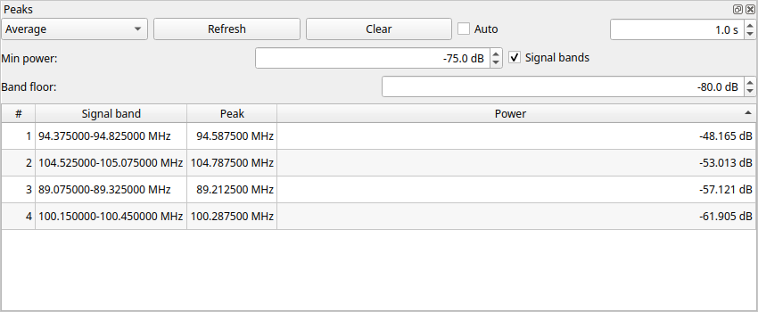

# QSpectrumAnalyzer: руководство пользователя

Руководство описывает функции текущего кода проекта, версия приложения —
**2.2.0**. Дата подготовки: **9 сентября 2026 года**. Названия кнопок и полей
приведены на английском, как в интерфейсе.

Инструкция по установке и подключению оборудования находится в
[INSTALL_UBUNTU_26_RU.md](INSTALL_UBUNTU_26_RU.md).

## Содержание

1. [Назначение программы](#1-назначение-программы)
2. [Запуск](#2-запуск)
3. [Первое измерение](#3-первое-измерение)
4. [Главное окно и панели](#4-главное-окно-и-панели)
5. [Параметры измерения](#5-параметры-измерения)
6. [Выбор backend и устройства](#6-выбор-backend-и-устройства)
7. [Спектр и управление графиками](#7-спектр-и-управление-графиками)
8. [Водопад и цветовая шкала](#8-водопад-и-цветовая-шкала)
9. [Обработка спектра](#9-обработка-спектра)
10. [Поиск пиков и полос сигналов](#10-поиск-пиков-и-полос-сигналов)
11. [Фоновый спектр Baseline](#11-фоновый-спектр-baseline)
12. [Экспорт и сохранение настроек](#12-экспорт-и-сохранение-настроек)
13. [Практические сценарии](#13-практические-сценарии)
14. [Сообщения и устранение затруднений](#14-сообщения-и-устранение-затруднений)
15. [Ограничения текущей версии](#15-ограничения-текущей-версии)

## Об иллюстрациях

Скриншоты сделаны в запущенном приложении с PyQt5. Спектры, водопад и
таблицы на них заполнены **синтетическими демонстрационными данными**;
это не запись радиоэфира и не результаты измерения конкретного SDR.
Настройки на снимках служат для иллюстрации элементов управления.
Снимки диалогов показывают настоящий интерфейс текущей версии.

## 1. Назначение программы

QSpectrumAnalyzer показывает распределение уровня сигнала по частоте и его
изменение во времени. Измерения выполняет внешняя программа — **backend**,
которая управляет SDR-приёмником. QSpectrumAnalyzer задаёт её параметры,
принимает результаты и строит графики.

Доступны непрерывное сканирование и одиночный проход, текущий спектр,
усреднение, накопление максимумов и минимумов, сглаживание, послесвечение,
водопад, поиск пиков, выделение полос сигналов и вычитание опорного спектра.

Интерфейс подписывает уровень как **Power, dB**. Не следует автоматически
считать эти значения калиброванными dBm: их смысл зависит от backend,
приёмника и настройки измерения. Программа сама не выполняет абсолютную
калибровку измерителя мощности.

## 2. Запуск

В активированном окружении обычная команда запуска:

```bash
qspectrumanalyzer
```

Также доступен запуск модулем:

```bash
python -m qspectrumanalyzer
```

Для существующего окружения на этом компьютере проверен запуск с явным
выбором PyQt5 и без принудительного системного `PYTHONPATH`:

```bash
env -u PYTHONPATH QT_PREFERRED_BINDING=PyQt5 PYQTGRAPH_QT_LIB=PyQt5 \
    /home/dock/venv/qspectr/bin/qspectrumanalyzer
```

Строка для ярлыка GNOME с явным выбором X11/XWayland:

```ini
Exec=env -u PYTHONPATH QT_PREFERRED_BINDING=PyQt5 PYQTGRAPH_QT_LIB=PyQt5 QT_QPA_PLATFORM=xcb /home/dock/venv/qspectr/bin/qspectrumanalyzer
```

Путь относится к данному компьютеру; на другой установке замените его.
`Terminal=true` в ярлыке оставляет видимыми сообщения backend и диагностику.

Параметр `--version` выводит версию, `--help` — справку запуска.
Предусмотрен также `--debug`; он, в частности, сохраняет консоль на Windows.
Основные параметры измерений задаются в окне приложения.

## 3. Первое измерение

1. Подключите приёмник и закройте другие программы, использующие его.
2. Откройте **File → Settings...**.
3. Выберите **Backend**, укажите **Executable** и **Device**.
4. Проверьте **Sample rate**, при необходимости **Bandwidth**, нажмите **OK**.
5. В панели **Frequency** задайте **Start**, **Stop** и **Bin size**.
   Начальная частота должна быть меньше конечной, обе — в диапазоне устройства.
6. В панели **Settings** задайте **Interval**, **Gain**, при необходимости
   **Corr.** и **Crop**.
7. Нажмите **Single shot**, чтобы получить одиночное измерение, или **Start**
   для непрерывной работы.
8. Для завершения измерения нажмите **Stop**.

**Каждый новый Start или Single shot начинает новую серию:** очищаются
история водопада, накопленные среднее/максимумы/минимумы и таблица пиков.
Stop прекращает получение данных; результаты можно рассматривать после остановки.

Параметры приёмника применяются при запуске измерения. После изменения частот,
усиления или интервала остановите и заново запустите сканирование.
Переключатели отображения и обработки можно использовать для уже полученных данных.
Принятие диалога **File → Settings...** останавливает активный backend и
создаёт новое хранилище данных; рассматривайте это как перенастройку измерения.

## 4. Главное окно и панели


*Рисунок 1. Главное окно: текущий спектр — жёлтый, среднее — голубое,
максимумы — красные. Кратковременный демонстрационный сигнал около 97,7 MHz
остаётся в Max. hold и виден отдельным отрезком на водопаде.*

В центральной части находятся спектр и водопад. Разделитель между ними
позволяет менять их высоту.

| Панель | Содержимое |
| --- | --- |
| Controls | Start, Stop, Single shot |
| Frequency | Начальная и конечная частота, размер частотного отсчёта |
| Settings | Интервал, усиление, коррекция, обрезка, кривые и обработка |
| Levels | Гистограмма, уровни и палитра водопада |
| Peaks | Таблица пиков или полос сигналов |

Панели можно перемещать за заголовок, располагать вкладками, отделять от окна
и закрывать. Вернуть отдельную панель можно через **View → имя панели**.
**View → Show All Panels** показывает все панели, но не сбрасывает их
расположение к заводскому виду.

**File → Quit** закрывает приложение, **Help → About** показывает сведения
о программе. При обычном закрытии сохраняются основные настройки и геометрия окна.

Строка состояния во время измерения показывает:

- **Total time** — время текущей серии;
- **Sweep time** — интервал между последними обновлениями данных;
- **FPS** — частоту обновления, рассчитанную из этого интервала;
- **Frequency hops** — число частотных перестроек, если backend его предоставляет.

Индикатор прогресса ориентируется на заданный Interval. Это оценка ожидания,
а не точный процент уже просканированного диапазона.

## 5. Параметры измерения

| Поле | Единицы | Значение и применение |
| --- | --- | --- |
| Start | MHz | Нижняя граница обзора |
| Stop | MHz | Верхняя граница обзора |
| Bin size | kHz | Запрашиваемый размер частотного отсчёта; меньший размер даёт больше точек |
| Interval | s | Интервал/время накопления, интерпретация зависит от backend |
| Gain | dB | Запрашиваемое усиление приёмника |
| Corr. | ppm | Частотная коррекция для backend и устройств, которые её поддерживают |
| Crop | % | Исключение краёв отдельных участков спектра, где могут быть искажения |

Меньший Bin size помогает различать близкие сигналы, но увеличивает объём
данных и нагрузку. Фактический шаг зависит от FFT и округлений backend.
Число знаков в таблице частот не означает такую же точность измерения.

Увеличение Gain поднимает сигналы, но может привести к перегрузке приёмника.
Для сравнения нескольких измерений сохраняйте одинаковое фиксированное усиление.
Отрицательное значение Gain в ряде адаптеров означает, что явное усиление
не передаётся backend; конкретный автоматический режим определяется утилитой.
Для hackrf_sweep отрицательное значение не следует считать полноценным AGC.

Crop поддерживается не всеми backend. Слишком большое значение может сделать
настройку непригодной; доступность числа в поле не гарантирует, что выбранная
утилита и устройство смогут с ним работать.

Пределы полей меняются при выборе backend. Это общие пределы адаптера,
а не результат автоматического определения возможностей подключённого устройства.

## 6. Выбор backend и устройства

### Поддерживаемые адаптеры

| Backend | Назначение и особенности текущего приложения |
| --- | --- |
| soapy_power | Backend по умолчанию, работа через SoapySDR; выбор устройства строкой Device |
| hackrf_sweep | Обзор диапазона средствами HackRF; бинарный поток результатов |
| rtl_power | Работа с RTL-SDR через rtl_power |
| rtl_power_fftw | Работа с RTL-SDR через альтернативную FFTW-утилиту |
| rx_power | Адаптер rx_tools; в README проекта помечен как неподдерживаемый |

Наличие адаптера в списке не означает, что соответствующая утилита и драйвер
установлены. Поддержка конкретного SDR зависит от внешнего программного обеспечения.

Для hackrf_sweep адаптер использует sample rate 20 MHz, ограничивает Bin size
диапазоном 3–5000 kHz и округляет ширину обзора до шагов 20 MHz.
Общее усиление распределяется между LNA и VGA. PPM и Crop этим адаптером
не применяются; поле Device не передаётся как отдельный выбор устройства.
Interval здесь ограничивает частоту передачи проходов в приложение.

### Поля File → Settings...


*Рисунок 2. Настройки backend: исполняемый файл, устройство, частота
дискретизации, полоса, смещение LNB и дополнительные параметры.*

| Поле | Описание |
| --- | --- |
| Backend | Внешняя программа для получения спектра |
| Executable | Имя команды или путь к исполняемому файлу; кнопка `...` открывает выбор файла |
| Device | Идентификатор устройства в формате выбранного backend |
| Sample rate | Частота дискретизации в MHz; не равна ширине всего обзора |
| Bandwidth | Запрашиваемая полоса приёмника в MHz, если поддерживается |
| LNB LO | Частотное смещение внешнего преобразователя в MHz |
| Waterfall history size | Число строк спектра в памяти, по умолчанию 100 |
| Additional parameters | Дополнительные аргументы командной строки backend |

Для soapy_power примеры Device: `driver=hackrf`, `driver=rtlsdr`,
`driver=plutosdr`. Это примеры селекторов; при нескольких устройствах может
понадобиться серийный номер или другой уточняющий параметр.

Кнопка **?** возле Device доступна для backend, предоставляющего такую справку.
У soapy_power она запускает обнаружение и запрос информации об устройстве.
Кнопка **?** возле Additional parameters показывает справку установленной утилиты.

У soapy_power значение Bandwidth 0 означает, что приложение не передаёт
явный параметр полосы. Для LNB LO подсказка интерфейса задаёт отрицательное
смещение для повышающего преобразователя и положительное для понижающего.
Без преобразователя оставьте 0.

Дополнительные параметры soapy_power по умолчанию:

```text
--even --fft-window boxcar --remove-dc
```

Они передаются внешней утилите. Не добавляйте параметры, меняющие формат
выходных данных или способ их передачи: приложение ожидает определённый протокол.
Также избегайте противоречащих друг другу настроек в полях и дополнительных аргументах.

После смены Backend сбрасываются некоторые поля диалога, а после его
подтверждения — некоторые основные параметры. Поэтому сначала выбирайте
backend, затем проверяйте частоты и параметры измерения.

## 7. Спектр и управление графиками

Горизонтальная ось — частота, вертикальная — уровень в dB. Масштаб единиц
частоты на оси может автоматически меняться.

Перемещение мыши над спектром показывает перекрестие и подпись `f=... MHz,
P=... dB`. Это **координаты указателя**, а не автоматическое измерение
ближайшего пика: указатель не привязан к линии спектра.

Перетаскивание и колесо мыши позволяют перемещать и масштабировать график.
Правая кнопка открывает меню PyQtGraph с настройками осей, вида и экспортом.
Точный состав стандартного меню зависит от установленной версии PyQtGraph.

Частотные оси спектра и водопада связаны. Команда **View All** на любом
из графиков возвращает оба к диапазону Start–Stop. Для спектра подбирается
вертикальный диапазон по имеющимся данным, в том числе накопленным кривым
и baseline; поэтому скрытая кривая тоже может влиять на получившийся масштаб.

### Отображаемые кривые

| Переключатель | Что показывает | Цвет по умолчанию |
| --- | --- | --- |
| Main curve | Последний обработанный спектр | Жёлтый |
| Max. hold | Максимум для каждой частотной точки в серии | Красный |
| Min. hold | Минимум для каждой частотной точки в серии | Синий |
| Average | Накопленное среднее | Голубой |
| Persistence | Следы предыдущих спектров с затуханием | Зелёный |
| Baseline | Загруженный опорный спектр | Пурпурный |

Флажки Main curve, Max. hold, Min. hold и Average управляют видимостью,
а не отдельным запуском измерения. Накопление статистики идёт и при скрытых
кривых. Для сброса накопления остановите и начните новую серию.

**Colors...** открывает выбор цветов перечисленных кривых. Цвета водопада
меняются отдельно, в Levels.


*Цвета основной кривой, максимумов, минимумов, среднего, послесвечения
и baseline настраиваются независимо.*

## 8. Водопад и цветовая шкала


*Рисунок 3. Панель Levels. Границы на гистограмме задают диапазон уровней
для отображения; цветовая полоса задаёт соответствие уровня и цвета.*

Каждая строка водопада — один полученный спектр. Цвет кодирует уровень.
Новые строки располагаются у отметки 0, старые сдвигаются к отрицательным
значениям вертикальной шкалы.

Несмотря на подпись **Time**, вертикальная шкала текущей версии измеряется
**строками истории, а не секундами**. Например, 100 строк при фактическом
обновлении раз в 0,5 s соответствуют приблизительно 50 s наблюдения.
При неравномерных обновлениях это только оценка.

Waterfall history size ограничивает число хранимых строк. При заполнении
старые данные вытесняются. Изменять масштаб по вертикали мышью нельзя:
он закреплён по размеру истории. Частотный масштаб связан со спектром.

В панели **Levels** изменяйте границы уровней на гистограмме, чтобы выделить
слабые сигналы и не пересветить сильные. Редактор цветового градиента позволяет
выбрать палитру; исходная палитра — `flame`.
Изменение палитры и уровней меняет изображение, но не измеренные значения.

Основная история хранится без сглаживания. Вычитание baseline, напротив,
влияет и на водопад. Поэтому после включения Smoothing линия спектра может
стать ровнее, а водопад сохранить мелкие детали.

Большая история при мелком Bin size требует много памяти. Только массив
из 1000 строк по 100000 отсчётов занимает около 800 MB; отображение и
промежуточные данные требуют дополнительной памяти.

## 9. Обработка спектра

### Average, Max. hold и Min. hold

Average усредняет значения в каждой частотной точке. Усреднение выполняется
над поступающими значениями уровня, а не через перевод dB в линейную мощность.
Max. hold сохраняет наибольшие, Min. hold — наименьшие значения по точкам.

При неизменных настройках статистика накапливается в пределах серии.
Изменение сглаживания или baseline вызывает пересчёт по оставшейся истории:
старые, уже вытесненные строки в такой пересчёт не входят.

### Smoothing


*Рисунок 4. Выбор функции и длины окна сглаживания.*

Флажок **Smoothing** включает сглаживание по соседним частотным точкам.
Кнопка **...** рядом открывает параметры:

- **Window function**: `rectangular`, `hanning`, `hamming`, `bartlett`, `blackman`;
- **Window length**: длина окна в отсчётах, по умолчанию 11;
- функция по умолчанию — `hanning`.

`rectangular` соответствует скользящему среднему. Чем шире окно, тем сильнее
сглаживание и тем заметнее могут уменьшаться узкие пики. Это обработка
готового спектра; она отличается от FFT-окна внешнего backend.
Длина окна не должна превышать число точек спектра.

### Persistence


*Рисунок 5. Длина послесвечения в кадрах и закон затухания.*

Флажок **Persistence** добавляет следы предыдущих спектров. В диалоге **...**:

- **Persistence length** — количество следов, по умолчанию 5;
- **Decay function** — `linear` или `exponential`, по умолчанию `exponential`.

Затухание выражается прозрачностью старых кривых. Длина задаётся в кадрах,
а не секундах. Этот режим помогает видеть кратковременные изменения и
отличается от Max. hold: он показывает отдельные недавние кривые.

## 10. Поиск пиков и полос сигналов


*Рисунок 6. Увеличенная панель Peaks: источник Average, ручное обновление,
порог −75 dB и таблица максимумов демонстрационного спектра.*

Панель **Peaks** анализирует накопленный спектр. В обычном режиме показывает
до **20 самых сильных локальных максимумов**, прошедших порог.

### Управление

| Элемент | Действие |
| --- | --- |
| Average / Max hold | Выбор источника анализа |
| Refresh | Пересчитать таблицу по текущим накопленным данным |
| Clear | Очистить только строки таблицы |
| Auto | Автоматически обновлять таблицу при появлении новых данных |
| Поле времени | Интервал обновления таблицы от 0,1 до 60 s; по умолчанию 1 s |
| Min power | Минимальный уровень включаемого пика; по умолчанию −120 dB |
| Signal bands | Переключить таблицу на полосы сигналов |
| Band floor | Порог объединения соседних точек в полосу; по умолчанию −60 dB |

Интервал Auto не меняет Interval измерений. Auto изначально выключен.
Clear не сбрасывает Average или Max hold: Refresh либо следующее
автоматическое обновление может снова заполнить таблицу.

Для списка устойчивых сигналов выберите Average. Для поиска кратковременных
появлений — Max hold. Источник доступен независимо от видимости его кривой.
В текущем интерфейсе выключение флажка Average очищает таблицу; для повторного
заполнения нажмите Refresh.

В режиме пиков столбцы: **#**, **Frequency**, **Power**. Частота показана
в MHz, уровень — в dB. Нажатие на заголовок сортирует таблицу по числовому
значению. Сначала отбираются сильнейшие 20 пиков, затем применяется выбранная
сортировка: сортировка по частоте не расширяет список результатов.

Алгоритм ищет локальные максимумы среди соседних отсчётов. Крайние точки
спектра в обычном режиме не считаются пиками. Отдельной настройки расстояния
между пиками или их выраженности нет.

### Signal bands



*Рисунок 7. Те же демонстрационные данные в режиме Signal bands:
отображаются границы полос, частота максимума и его уровень.*

Включите Signal bands, чтобы объединить соседние точки с уровнем не ниже
Band floor. Для каждой полосы показываются **Signal band** (границы),
**Peak** (частота максимума) и **Power** (его уровень), а также номер.

Min power применяется к максимуму полосы. Band floor определяет её ширину
и разделение с соседними сигналами. Если между двумя максимумами уровень
не опускается ниже Band floor, они попадут в одну полосу. Повышение порога
может сузить или разделить полосы; понижение — расширить и объединить.

Пример: при Band floor = −70 dB непрерывный участок выше −70 dB образует
полосу. При Min power = −50 dB она попадёт в таблицу, только если её максимум
достигает −50 dB. Выводится не более 20 полос с наиболее сильными максимумами.

Границы оцениваются по краям частотных отсчётов. Это пороговая оценка,
а не измерение занятой полосы по заданному проценту мощности. Выделение строки
не настраивает приёмник на выбранную частоту и не запускает декодирование.

## 11. Фоновый спектр Baseline


*Рисунок 8. Выбор baseline-файла. Пустое поле на снимке означает,
что опорный файл ещё не выбран.*

Baseline — опорный спектр, загруженный из файла. Его можно показывать
отдельной кривой и вычитать из измеряемого спектра.

1. Нажмите **...** рядом с Baseline.
2. В поле **Baseline file** выберите файл.
3. Подтвердите выбор кнопкой **OK**.
4. Включите **Baseline**, чтобы видеть опорную кривую.
5. Включите **Subtract baseline**, чтобы вычитать её из данных.

Оба флажка независимы: показ фона не включает вычитание, а вычитание
не требует показа опорной кривой.

Читается **бинарный формат soapy_power**, а не произвольный CSV, изображение
или запись IQ. Если файл содержит несколько проходов, они усредняются.
Отдельной кнопки записи текущего спектра в baseline-файл в приложении нет;
его нужно подготовить внешними средствами, поддерживающими этот формат.

Для корректного вычитания используйте совпадающие частотный диапазон,
число отсчётов, их расположение и параметры измерения. Приложение проверяет
совпадение длины массивов, но не гарантирует совпадение частотных сеток и
не интерполирует фон автоматически. При разной длине вычитание не применяется.

Вычитание производится непосредственно над значениями уровня. Если данные
выражены в dB, результат — разность уровней в dB, а не вычитание физических
мощностей в линейных единицах. Меняются основной спектр, статистика и водопад.

## 12. Экспорт и сохранение настроек

Для экспорта откройте контекстное меню графика правой кнопкой мыши и выберите
**Export...**. Выберите нужный объект, доступный формат и параметры экспорта.
Набор форматов определяется установленной версией PyQtGraph и типом объекта.
Экспорт видимого графика не является записью всей последовательности измерений.

В текущем интерфейсе нет отдельной команды экспорта таблицы Peaks,
записи IQ, сохранения всей истории FFT или воспроизведения ранее записанного
сеанса. Чтение файла baseline не является режимом воспроизведения спектра.

При обычном закрытии сохраняются частоты, Bin size, Interval, Gain, PPM,
Crop, переключатели кривых и обработки, положение и размеры окна, состояние
панелей и разделителя. Настройки backend и диалогов сохраняются после OK.

Измеренные спектры и накопленная статистика между запусками не сохраняются.
Параметры Peaks (источник, пороги, Auto, интервал и режим полос) в текущем
коде не сохраняются. Собственного сохранения палитры/уровней водопада также нет.

## 13. Практические сценарии

### Рассмотреть устойчивые сигналы

1. Задайте диапазон, начните измерение с фиксированным Gain.
2. Включите Main curve и Average, дождитесь нескольких проходов.
3. В Peaks выберите Average и нажмите Refresh либо включите Auto.
4. Поднимите Min power, если в списке слишком много слабых максимумов.
5. Остановите измерение и увеличьте интересующий участок графика.

### Найти кратковременные сигналы

1. Начните новую серию, включите Max. hold и при необходимости Persistence.
2. Наблюдайте отдельные появления на водопаде.
3. Выберите Max hold в Peaks и обновите список.
4. Перед следующей независимой проверкой выполните Stop → Start,
   иначе старые максимумы останутся в накопленной кривой.

### Оценить границы широкого сигнала

1. Выберите Average в Peaks и включите Signal bands.
2. Задайте Band floor выше наблюдаемого фона, но ниже основной части сигнала.
3. Настройте Min power для отбора нужных полос.
4. Сопоставьте границы в таблице с графиком; попробуйте соседние значения
   Band floor, чтобы понять зависимость результата от порога.

### Сравнить с опорным измерением

1. Загрузите совместимый baseline-файл и покажите Baseline.
2. Проверьте соответствие диапазона и условий измерения.
3. Включите Subtract baseline и оцените разность уровней.
4. Для следующего сравнения с другими условиями подготовьте соответствующий фон.

## 14. Сообщения и устранение затруднений

| Симптом | Что проверить или сделать |
| --- | --- |
| Закрыта нужная панель | View → имя панели или Show All Panels |
| График ушёл за пределы окна | View All в контекстном меню графика |
| Водопад слишком тёмный или одноцветный | Уровни и градиент в Levels |
| Таблица Peaks пустая | Наличие данных, Refresh/Auto, Min power; в режиме полос также Band floor |
| После Clear пики появились снова | Clear очищает таблицу, а не накопленные данные |
| Старый сигнал остаётся в Max hold | Начните новую серию через Stop → Start |
| Нет данных от приёмника | Executable, Device, драйверы, диапазон и сообщения внешней утилиты в терминале |
| Device or resource busy | Завершите другое приложение, использующее SDR |
| Высокая нагрузка или задержки | Уменьшите диапазон/историю/Persistence, увеличьте Bin size; снизьте частоту обновления |
| Ошибка длины окна сглаживания | Уменьшите Window length до числа отсчётов спектра или ниже |
| Baseline не вычитается | Проверьте файл, формат, число отсчётов и флажок Subtract baseline |

При `ImportError: cannot import name 'uic' from 'PyQt6'` используйте
явный выбор PyQt5 из раздела «Запуск». В проверенном окружении системный
PyQt6 стал выбираться автоматически после установки другого приложения.

Предупреждения `undefined symbol ... version Qt_5` могут возникать при
смешивании системного PyQt5 и библиотек из venv. В данном окружении они
воспроизводились с `PYTHONPATH=/usr/lib/python3/dist-packages` и исчезали
после удаления этой переменной для запуска.

`Ignoring XDG_SESSION_TYPE=wayland on Gnome` само по себе не означает сбой:
приложение использует X11/XWayland. В приведённом ярлыке этот режим выбран
явно через `QT_QPA_PLATFORM=xcb`.

Сообщение `Frequency axis rebuilt from configured range` описывает
перестроение частотной шкалы под Start–Stop. Оно не подтверждает точность
частот при несовпадении запрошенного и фактического диапазона backend.

## 15. Ограничения текущей версии

- Частотная шкала строится равномерно по заданным Start–Stop. Если backend
  округлил диапазон, передал неполный проход или неравномерную сетку, частоты
  на графике и в Peaks могут не соответствовать фактическим. Особенно учитывайте
  округление диапазона hackrf_sweep до шагов 20 MHz.
- Число знаков после запятой в Peaks не заменяет частотную калибровку SDR
  и не повышает разрешение, заданное измерением.
- Изменение обработки пересчитывает статистику по доступной истории,
  а не обязательно по всей прошедшей серии.
- Водопад хранит ограниченное число строк; его шкала Time не является
  шкалой точных временных меток.
- В программе нет демодуляции звука, декодирования протоколов, автоматического
  распознавания передатчиков, системы частотных закладок или оповещений.
- Справка и допустимые параметры внешней утилиты зависят от её установленной
  версии. Пределы полей приложения не заменяют проверку возможностей приёмника.

Руководство сверено с исходным кодом текущей версии. Приложение запускалось с PyQt5 для
съёмки интерфейса и отображения демонстрационных данных; это не является
проверкой измерений со всеми перечисленными SDR и backend.
